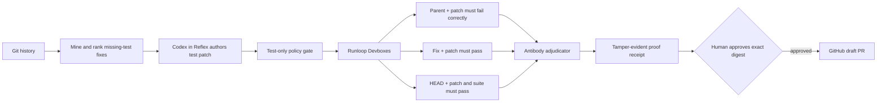

<div align="center">

# Antibody

**Codex finds regression tests that merged bug fixes forgot, authors the missing tests, and helps turn causally verified results into test-only draft PRs.**

[](https://github.com/psagar29/Antibody/actions/workflows/ci.yml)
[](package.json)
[](tsconfig.json)
[](LICENSE)

[30-second demo](#30-second-demo) · [How Codex works](#how-antibody-uses-codex) · [Sponsor architecture](#runloop--reflex-the-sponsor-stack) · [Real proof](#proof-case-caught-the-forgotten-regression) · [Live setup](#run-it-on-a-real-repository)

</div>

> Test generators ask, “What tests should this code have?” Antibody asks, “What failure did this historical fix prove we should never forget?”

Antibody turns Codex into a regression-test recovery agent. It mines Git history for production fixes with no matching test, gives Codex the exact historical change and bounded repository context, then accepts Codex's test only after a separate causal experiment proves it fails for the intended reason before the fix and passes on both the fix and current `HEAD`.

No “it passes now, ship it.” No “nonzero exit code means bug reproduced.” No autonomous merge. Evidence first; human-approved draft PR last.


<sub>Actual Antibody dashboard rendering from the deterministic offline fixture. Local, read-only, and backed by digest-verified receipt artifacts.</sub>

## 30-second demo

```bash
git clone https://github.com/psagar29/Antibody.git
cd Antibody
corepack enable && pnpm install --frozen-lockfile
pnpm demo
```

Expected terminal result before the dashboard opens:

```text
SIMULATED OFFLINE FIXTURE
VERIFIED sha256:<canonical-receipt-digest>
<repo>/.antibody/demo-runs/<run-id>
http://127.0.0.1:<available-port>
```

Open the printed URL. Inspect the parent/fix/`HEAD` evidence matrix, generated patch, receipt digest, raw artifacts, environment identity, cleanup records, and final verdict.

The demo is deliberately marked `simulated: true`. It uses checked-in deterministic Git history, a fixed Codex-style authoring response, and local worktrees. It exercises the complete control flow without credentials and without laundering fake vendor calls into “live” evidence.

### One-command installation

Install the current GitHub build globally:

```bash
npm install --global github:psagar29/Antibody#main
```

Or execute without a persistent installation:

```bash
npx --yes --package=github:psagar29/Antibody#main antibody --version
```

After `0.1.0` is published to npm, the stable registry path will be:

```bash
npm install --global @psagar29/antibody@0.1.0
```

This repository does **not** claim npm publication yet. `pnpm package:smoke` packs the exact npm payload, installs it into a clean temporary project, runs its binary and demo, then verifies the resulting receipt.

## Why it matters

A merged fix captures something unusually valuable: a known-bad behavior, the precise production change that corrected it, and a repository state where the bug still exists. When no regression test lands with that fix, this evidence usually disappears into history.

Antibody converts that history into an executable specification:

1. Find production-only fixes likely missing tests.
2. Ask Codex to reconstruct the forgotten behavioral assertion.
3. Prove the assertion against the pre-fix and post-fix code.
4. Preserve every claim in a tamper-evident receipt.
5. Let a human approve the exact artifact before a draft PR exists.

Result: test coverage based on demonstrated regressions, not speculative line coverage.

## How Antibody uses Codex

Codex is central to the authoring loop, not the trust boundary.

1. **Investigate.** Antibody gives Codex the immutable fix SHA, production diff, nearby source, repository tree, framework files, and existing test patterns.
2. **Author.** Codex returns a focused unified diff containing only the missing regression test and allowed fixtures.
3. **Repair.** When bounded feedback shows a correctable test problem, Antibody can continue the same Reflex session for a limited repair turn.
4. **Explain.** The accepted patch and exposed Reflex provenance remain attached to the run for review.
5. **Yield authority.** Codex cannot declare itself correct, access Runloop credentials, approve a receipt, merge code, or force-push.

This separation matters. Codex does the high-context reasoning; deterministic policy and independent execution decide whether its work is admissible.

## Proof case: caught the forgotten regression

The checked-in demonstration builds a real four-commit Git repository with fixed identities and timestamps. Its production-only fix changes a slug helper from replacing one space to collapsing repeated whitespace:

```diff
-  return value.trim().toLowerCase().replace(' ', '-');
+  return value.trim().toLowerCase().replace(/\s+/gu, '-');
```

Codex's recovered test patch is:

```diff
+test('collapses repeated whitespace', () => {
+  assert.equal(slugify('Hello   World'), 'hello-world');
+});
```

Recorded experiment:

| Evidence lane | Attempts | Result |
| --- | ---: | --- |
| Parent baseline | 1 | Existing suite passes |
| Fix baseline | 1 | Existing suite passes |
| Parent + recovered test | 2 | Same intended assertion failure both times |
| Fix + recovered test | 2 | Passes both times |
| Current `HEAD` + recovered test | 1 | Targeted test passes |
| Current `HEAD` full suite | 1 | Suite passes |

Measured fixture facts:

| Metric | Result |
| --- | ---: |
| Candidate commits mined and ranked | 2 |
| Verification command attempts | 8 |
| Repeated parent failures | 2/2 equivalent |
| Repeated fix passes | 2/2 passing |
| Recovered tests | 1 |
| Changed paths | 1 test file |
| External provider calls | 0 |
| Provider cost | $0 for simulated demo |

The recovered test catches the original regression. Patch scope: one test file. Candidate identity, patch digest, normalized failure signature, commit SHAs, and expected verdict are pinned in [the fixture contract](fixtures/demo-history/expected.json). The generated receipt is re-read and digest-verified before the demo reports `VERIFIED`.

This is a complete, reproducible product run—not a live Runloop/Reflex sponsor run and not a GitHub draft PR. Those claims remain withheld until credentialed evidence exists.

## What Antibody proves

Given fix commit `F`, first parent `P`, current head `H`, and generated test-only patch `T`:

| Lane | Experiment | Required observation |
| --- | --- | --- |
| Applicability | `P` and `F` without `T` | Existing baseline passes; historical checkout is runnable |
| Bug presence | `P + T` | Repeated, stable failure matching intended behavior |
| Fix causality | `F + T` | Targeted test passes repeatedly |
| Present-day value | `H + T` | Targeted test is collected and passes; configured suite stays green |
| Patch policy | `T` | Only approved test and fixture paths changed |

A nonzero exit code proves nothing by itself. Setup errors, dependency failures, timeouts, crashes, platform failures, missing reports, truncated output, inconsistent repetitions, and unrelated assertions produce `inconclusive` or `rejected`—never `verified`.



## Runloop + Reflex: the sponsor stack

Sponsor integration is structural—not a logo pasted onto a generic wrapper.

### Reflex — the repeatable Codex command center

The hackathon brief presents the **Unit Test Persona** as a flagship Reflex workflow. Antibody turns that example into a continuously reusable recovery system:

- Launches an existing, calibrated Persona through `@runloop/reflex-client`.
- Supplies bounded historical context, exact fix identity, production diff, framework metadata, and test constraints.
- Consumes replay-safe streamed output with bounded polling fallback.
- Continues the same session for limited, evidence-driven repair turns.
- Records real `agentId`, `streamId`, and `personaId` provenance exposed by the public API.
- Stops the session deterministically; Reflex never receives publication authority or Runloop credentials.

Reflex supplies the operational layer Codex work needs: reusable Persona configuration, managed session lifecycle, preserved context, and inspectable output. Antibody can repeatedly launch a calibrated regression-test specialist instead of rebuilding a prompt, toolchain, model choice, and environment for every repository.

**Inspect it:** [Reflex adapter](src/adapters/reflex/adapter.ts) · [contract fixtures](test/adapters/reflex/contract-fixtures.test.ts) · [adapter tests](test/adapters/reflex/adapter.test.ts)

### Runloop — the causal verification laboratory

Generated code needs a trustworthy, reproducible, disposable place to fail. Antibody uses `@runloop/api-client` to:

- Resolve an immutable Blueprint or Snapshot and optional restrictive Network Policy.
- Provision isolated Linux Devboxes with the repository mounted at creation.
- Check out exact `P`, `F`, and `H` commit identities—not moving branch names.
- Upload patch bytes without shell interpolation and verify SHA-256 inside the Devbox.
- Execute argv-based setup and test plans with in-box and controller deadlines.
- Persist redacted stdout, stderr, structured reports, termination state, and environment metadata.
- Attempt shutdown for every confirmed Devbox and record cleanup outcomes in the receipt.

Runloop provides exactly what causal verification demands: isolated execution, fast environment provisioning, lifecycle control, explicit network boundaries, and inspectable artifacts. Antibody runs a controlled software experiment instead of asking the authoring agent whether its own test “looks good.”

**Inspect it:** [Runloop adapter](src/adapters/runloop/adapter.ts) · [lifecycle tests](test/adapters/runloop/lifecycle.test.ts) · [contract fixtures](test/adapters/runloop/contract-fixtures.test.ts)

### Better together

| Layer | Owner | Responsibility |
| --- | --- | --- |
| Agent workflow | **Reflex** | Launch calibrated Codex Persona, stream work, continue or stop session |
| Execution substrate | **Runloop** | Provision isolated Devboxes, mount code, execute bounded commands, expose lifecycle |
| Trust controller | **Antibody** | Mine candidates, constrain patches, classify evidence, adjudicate causality, persist receipts |
| Release authority | **Human + GitHub** | Approve exact receipt digest; review draft PR |

Reflex turns one successful Codex authoring setup into a repeatable workflow. Runloop gives each proof attempt a secure, inspectable machine. Antibody joins them with a domain-specific causal gate neither sponsor product should have to reinvent. That is the product.

Full detail: [sponsor integration notes](docs/sponsors.md) and [Runloop/Reflex adapter runbook](docs/runloop-reflex.md).

> **Integration integrity:** Tenor is not used, so Antibody does not claim it. No Tenor or Slack SDK, adapter, API call, mock, or hidden dependency exists.

## Why this is not another test generator

| Typical test agent | Antibody |
| --- | --- |
| Generates against current code | Mines historical production-only fixes missing tests |
| Checks whether a test passes now | Requires the same patch to fail before the fix and pass after it |
| Treats any failure as useful | Separates intended assertion failures from infrastructure noise |
| Runs inside its authoring environment | Separates Reflex authoring from Runloop verification |
| Returns prose and a diff | Emits a canonical receipt plus hashed evidence and artifacts |
| Can immediately open or merge code | Requires exact digest approval and creates draft test-only PRs only |

The output is not merely a test. It is a test plus a reproducible argument for why the test belongs in the repository.

## Durable proof receipts

Every completed run persists a self-contained receipt directory:

```text
<run-id>/
├── receipt.json             # canonical verdict and provenance
├── receipt.sha256           # approval identity
├── candidate.json           # immutable Git candidate
├── patch.diff               # normalized test-only patch
├── raw-evidence.json        # provider observations
├── classifications.json     # Antibody's interpretation
└── artifacts/               # redacted stdout, stderr, and reports
```

Receipts bind commit SHAs, patch bytes, evidence artifacts, classifications, environment identity, cleanup outcomes, reason codes, and available cost fields. Hashes detect mutation; they are not digital signatures or remote attestation.

```bash
antibody receipt verify <receipt-directory> --json
antibody receipt render <receipt-directory> --output proof.html
antibody dashboard .antibody/runs
```

## Run it on a real repository

Requirements:

- Node.js 22+
- Git repository with a GitHub `origin`
- Configured Reflex organization, API key, and existing Persona calibrated for Codex
- Runloop API key plus exactly one Blueprint or Snapshot
- Billable-use authorization; `GITHUB_TOKEN` only for private mounts or publication

```bash
cp .env.example .env.local
# Export values securely; Antibody does not load plaintext secret files for you.

antibody init . --preset node-test
antibody doctor . --json
antibody scan . --limit 10 --json
antibody recover . --candidate <full-sha-or-candidate-id> --output .antibody/runs --json
```

Supported presets: `node-test`, `ava`, `vitest`, `jest`, and `pytest`. Custom argv-based commands and structured reports live in `.antibody.yml`.

`recover` handles one selected candidate. `run` selects the highest-ranked candidate unless `--candidate` is supplied. Neither publishes.

Publication remains separate:

```bash
antibody publish <receipt-directory> \
  --approve <exact-sha256-receipt-digest> \
  --repository . \
  --json
```

The publisher re-verifies receipt and patch digests, test-only policy, materialized file bytes, and remote base SHA. It creates only a draft PR. It cannot merge or force-push.

## CLI

| Command | Purpose |
| --- | --- |
| `antibody init` | Generate strict repository configuration |
| `antibody doctor` | Validate repository, config, remotes, and credential presence without printing secrets |
| `antibody scan` | Rank historical production fixes that appear to lack regression tests |
| `antibody recover` | Author and verify one selected candidate with Reflex and Runloop |
| `antibody run` | Recover the highest-ranked candidate end to end |
| `antibody receipt verify` | Recompute digests and validate a persisted proof |
| `antibody receipt render` | Produce a self-contained HTML proof view |
| `antibody dashboard` | Browse verified local receipts in a loopback-only ledger |
| `antibody publish` | Create a human-approved draft PR from a verified receipt |
| `antibody demo fixture` | Run deterministic, credential-free demonstration |

## Security model

Target repositories, Git history, patches, model output, test reports, and command output are untrusted.

- Generated changes are limited to configured test and fixture paths.
- Production source, workflow, submodule, symlink, binary, oversized, and malformed patches are rejected.
- Live target setup and tests execute in Runloop—not on the operator machine.
- Credentials stay at adapter boundaries; literal secret values are redacted from evidence.
- Missing, malformed, truncated, flaky, or environment-mismatched evidence fails closed.
- Dashboard binds to `127.0.0.1`, serves no remote assets, escapes receipt data, and applies restrictive CSP.
- Publication requires a human-supplied canonical receipt digest and current remote SHA match.

Read [SECURITY.md](SECURITY.md) and the full [security model](docs/security-model.md) before using live credentials.

## Repository map

```text
src/contracts/        versioned schemas and provider-neutral ports
src/core/             mining, authoring, policy, classification, adjudication, receipts
src/adapters/reflex/  Reflex Persona session lifecycle
src/adapters/runloop/ Runloop Devbox verification lifecycle
src/adapters/github/  digest-gated draft publication
src/composition/      live and deterministic offline workflows
src/dashboard/        local proof ledger
src/viewer/           self-contained receipt renderer
src/cli/              installable command-line surface
```

Start with [architecture](docs/architecture.md). AI coding agents should read root [AGENTS.md](AGENTS.md), then the nearest scoped `AGENTS.md`; humans get the same invariants in the [AI contributor guide](docs/ai-contributor-guide.md).

## Development and verification

```bash
corepack enable
pnpm install --frozen-lockfile
pnpm check
pnpm package:smoke
git diff --check
```

`pnpm check` validates generated JSON schemas, ESLint, strict TypeScript, full Vitest suite, and production builds. CI repeats source validation and clean packed-package installation on Node.js 22.

## Status and honest limits

Antibody `0.1.0` is early-stage, intentionally narrow, and fail-closed. Live Reflex and Runloop adapters are implemented against their public TypeScript clients and covered by generated contract fixtures plus secret-free lifecycle fakes. A credentialed vendor smoke run has not yet been claimed. No real draft PR is presented as proof. Linux Devboxes cannot prove macOS, Xcode, iOS, or hardware-specific behavior.

Apache-2.0. See [LICENSE](LICENSE), [NOTICE](NOTICE), [THIRD_PARTY_NOTICES.md](THIRD_PARTY_NOTICES.md), [CONTRIBUTING.md](CONTRIBUTING.md), and [CHANGELOG.md](CHANGELOG.md).
